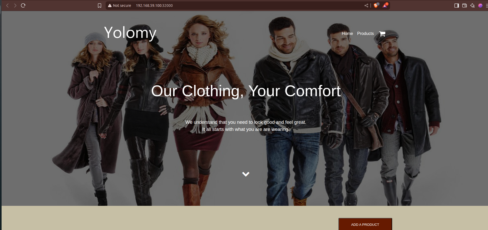

This README.md covers both MINIKUBE and GKE as Orchestrators 

################ MINIKUBE ################

Deploying your full-stack application (client (Frontend) + Backend + MongoDB) on Minikube, 
including 
    - Docker image building, 
    - Kubernetes manifests, 
    - service exposure, 
    - key project explanations.
    - Docker Registry: Docker Hub

# Full-Stack Kubernetes App on Minikube (Frontend + Backend + MongoDB)

This project demonstrates a full-stack web application composed of a React frontend, a Node.js backend, and MongoDB for storage. The app is containerized with Docker and deployed locally using Minikube and Kubernetes.

## Tech Stack

- Client (Frontend): Node.js
- Backend: Node.js + Express
- Database: MongoDB
- Orchestration: Kubernetes (Minikube)
- Storage: PersistentVolume for MongoDB
- Containerization: Docker

## Project Structure

.
├── backend/
│   └── Dockerfile
├── client/
│   └── Dockerfile
├── manifests/
│   ├── backend-deployment.yaml
│   ├── backend-service.yaml
│   ├── client-deployment.yaml
│   ├── client-service.yaml
│   ├── mongo-statefulset.yaml
│   └── mongo-service.yaml
├── explanation.md
└── README.md

##  Prerequisites

- Docker
- Minikube installed
- kubectl installed

##  Steps to Run Locally with Minikube

### 1. Start Minikube
On terminal

    minikube start

### 2Build Docker Images

Backend

cd backend
docker build -t marigah/backend-service:v2.0.0 .
docker push marigah/backend-service:v2.0.0 

Client

cd ../client
docker build -t marigah/client-service:v2.0.0 .
docker push marigah/client-service:v2.0.0 

### 3 Apply Kubernetes Manifests

cd ../manifests

kubectl apply -f mongo-service.yaml
kubectl apply -f mongo-statefulset.yaml

kubectl apply -f backend-deployment.yaml
kubectl apply -f backend-service.yaml

kubectl apply -f client-deployment.yaml
kubectl apply -f client-service.yaml

### 4. Expose client(Frontend) Service

minikube service client-service

This will open the app in your default browser using Minikube’s IP and NodePort.

http://192.168.59.100:32000

############### GKE #############################

Deploying your full-stack application (client (Frontend) + Backend + MongoDB) on Google Kubernetes Engine (GKE).
This README includes 
    - setup instructions, 
    - usage of Docker Hub images, 
    - Kubernetes manifests, 
    - GKE-specific steps

# Full-Stack Kubernetes Project on GKE

This project showcases a full-stack web application consisting of a cleint, a Node.js/Express backend, and MongoDB database, deployed using Google Kubernetes Engine (GKE). The backend and client(frontend) are containerized with independent Dockerfiles, and MongoDB is deployed using a StatefulSet.

## Project Structure

├── backend/
│   └── Dockerfile
├── client/
│   └── Dockerfile
├── manifests/
│   ├── backend-deployment.yaml
│   ├── backend-service.yaml
│   ├── client-deployment.yaml
│   ├── client-service.yaml
│   ├── mongo-statefulset.yaml
│   └── mongo-service.yaml
├── explanation.md
└── README.md

## Technologies Used

- Client (Frontend): Node
- Backend: Node.js + Express
- Database: MongoDB
- Containerization: Docker
- Orchestration: Kubernetes (GKE)
- Storage: Persistent Volumes for MongoDB
- Docker Registry: Docker Hub

##  Prerequisites

- Google Cloud CLI (`gcloud`)
- Docker installed and authenticated with Docker Hub
- Kubernetes CLI (`kubectl`)
- Kubernetes cluster created via GKE

##  Setup & Deployment

### 1. Clone the Repository

git clone git@github.com:NicholasMariga/yolo.git

### 2. Build and Push Docker Images

Backend

cd backend
docker build -t marigah/backend-service:v2.0.0 .
docker push marigah/backend-service:v2.0.0 

Client

cd ../client
docker build -t marigah/client-service:v2.0.0
docker push marigah/client-service:v2.0.0 

### 3. Connect to GKE

On terminal execute:

gcloud container clusters get-credentials your-cluster-name --zone your-zone --project your-project-id

### 4. Deploy MongoDB with StatefulSet

kubectl apply -f manifests/mongo-service.yaml
kubectl apply -f manifests/mongo-statefulset.yaml

### 5. Deploy Backend and Frontend

kubectl apply -f manifests/backend-deployment.yaml
kubectl apply -f manifests/backend-service.yaml

kubectl apply -f manifests/client-deployment.yaml
kubectl apply -f manifests/client-service.yaml

##  Accessing the Application

You can expose the client (frontend) service using a LoadBalancer:

kubectl get services

Note the EXTERNAL-IP of the client (frontend)  service and access it via browser.
