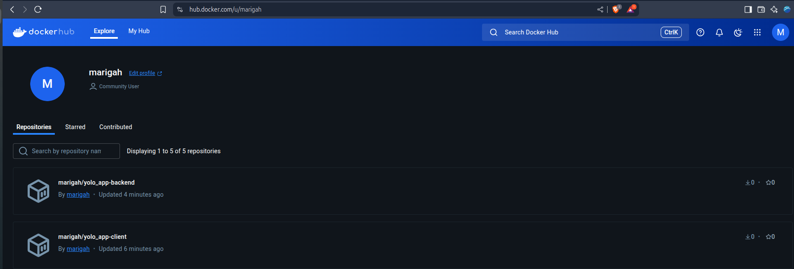

# 🧩 Microservices Web App with Node.js, PostgreSQL, and Docker Compose

This project is a full-stack microservices-based application built with a Node.js backend, a frontend client, and a mongodb database. The application is fully containerized using Docker and orchestrated with Docker Compose.

---

## Core Project Structure

.
├── backend/
│   ├── Dockerfile
│   ├── server.js
│   └── package.json
├── client/
│   ├── Dockerfile
│   ├── package.json
│   └── ...
├── docker-compose.yml
└── README.md

## How to Run the Application

### Prerequisites

- Docker
- Docker Compose
- Git
- Vagrant (optional if using `vagrant up --provision`)

### Steps

# Clone the repository
git clone https://github.com/NicholasMariga/yolo.git
cd yolo

# Run the application
docker-compose up --build

### Access the services

- Backend API: http://localhost:5000
- Frontend Client: http://localhost:3000

## Dockerfile Breakdown

### Backend Dockerfile

FROM node:14 AS build
WORKDIR /usr/src/app
COPY package*.json ./
RUN npm install
COPY . .

FROM alpine:3.16.7
WORKDIR /app
RUN apk update && apk add --update nodejs
COPY --from=build /usr/src/app /app
EXPOSE 5000
CMD ["node", "server.js"]

### Client Dockerfile

FROM node:14-slim AS build
WORKDIR /usr/src/app
COPY package*.json ./
RUN npm install
COPY . .

FROM alpine:3.16.7
WORKDIR /app
RUN apk update && apk add npm
COPY --from=build /usr/src/app /app
EXPOSE 3000
CMD ["npm", "start"]

## 🔧 docker-compose.yml

version: "3.8"

services:

  app-client:
    build: ./client
    stdin_open: true
    tty: true
    ports:
      - "3000:3000"
    depends_on: 
      - app-backend
    networks:
      - app-net

  app-backend:
    build: ./backend
    stdin_open: true
    tty: true
    restart: always
    ports:
      - "5000:5000"
    depends_on: 
      - app-ip-mongo
    networks:
      - app-net

 
  app-ip-mongo:
    image: mongo
    ports:
      - "27017:27017"
    networks:
      - app-net
    volumes:
      - type: volume
        source: app-mongo-data
        target: /data/db

networks:
  app-net:
    name: app-net
    driver: bridge
    attachable: true

volumes:
  app-mongo-data:
    driver: local

### Key Features

- Networking: All services communicate via `app-net` (bridge).
- Volumes: `app-mongo-data` ensures mongo data persistence.
- Image tagging: Follows the format `name:v1.0.0` for clarity.

## Git Workflow

git init
git remote add origin https://github.com/NicholasMariga/yolo.git
git checkout -b master
git add .
git commit -m "Initial commit"
git push -u origin master

##  Debugging Measures

- Check container logs:
  
  docker-compose logs app-backend
  docker-compose logs app-client
  
- Interactive shell into a container:

  docker exec -it app-backend sh
  
- Rebuild containers:
 
  docker-compose up --build --force-recreate
  
## Best Practices Followed

- Multi-stage Docker builds for optimized image size.
- Lightweight base images: `node:14`, `alpine:3.16.7`.
- Image tags for versioning: `v1.0.0`.
- Volume usage for database persistence.
- Custom bridge network to isolate services.

## Screenshot from DockerHub

> Replace with your actual screenshot  

