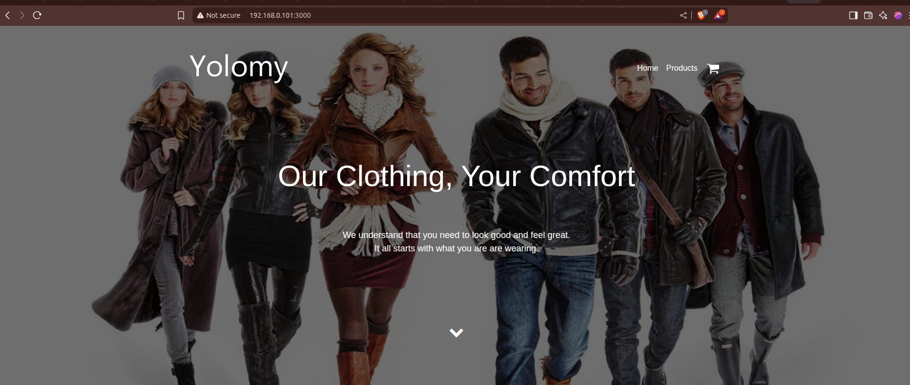

# YOLO App – Containerized Fullstack Application

##  Overview

The YOLO App is a 3-tier containerized web application consisting of:

- MongoDB  – the database
- Node.js (Express)  – the backend
- React.js  – the frontend

This application is deployed using  Docker containers , provisioned with  Vagrant  and automated using  Ansible .

## Architecture
React Frontend  <-->   Node.js Backend <-->   MongoDB DB
(app-client)        (app-backend)       (app-ip-mongo)

All containers are connected via Docker network `app-net`

## Tech Stack
                       
 Frontend --> React                      
 Backend  --> Node.js + Express          
 Database --> MongoDB                    
 Containerization --> Docker                     
 Provisioning --> agrant, VirtualBox
 Automation   --> Ansible        

## Docker Containers

1. Frontend Container
    Name: app-client
    Role: React App
    port: 3000

2. Backend Container
    Name: app-backend
    Role: Node js 
    port: 5000

2. Batabase Container
    Name: app-mongodb
    Role: MongoDB 
    port: 27017

Backend API connects to database over app-net
MongoDB uses volume for persistent storage

## How It Works

### 1. MongoDB
- Started via Ansible with volume for /data/db.
- Uses Docker image mongo.

### 2. Backend
- Multi-stage Docker build:
  - node:14 to install dependencies
  - alpine:3.16.7 for minimal runtime
- Connects to MongoDB via Docker network.
- Exposes port 5000.

### 3. Frontend
- Uses npm start (development mode).
- Exposes port 3000.
- Container may exit if not run in interactive mode or not built for production (`serve -s build` recommended for production).

### 4. Docker Networking
All containers connect to a custom Docker network named `app-net`.

### 5. Ansible Automation
- Handles:
  - Docker image builds
  - Container launches
  - Docker network and volume setup

### 6. Vagrant
- Provisions a VM with bridged networking so you can access the app from your browser.

  

## Accessing the Application

1. Ensure Vagrant is configured for bridged networking in your `Vagrantfile`:

   config.vm.network "public_network"

2. After provisioning:
   -  Frontend : `http://<VM-IP>:3000`
   -  Backend  : `http://<VM-IP>:5000`

Replace `<VM-IP>` with your VirtualBox VM's bridged IP address.

## Execution

vagrant up --provision

Or, if the VM is already up:

vagrant provision

## Screenshot

